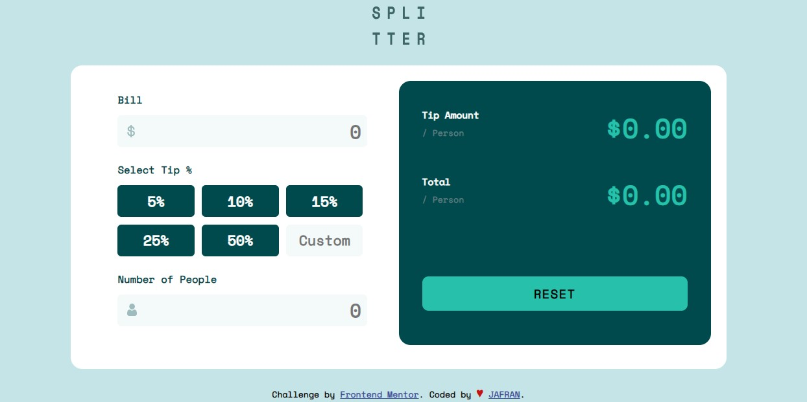
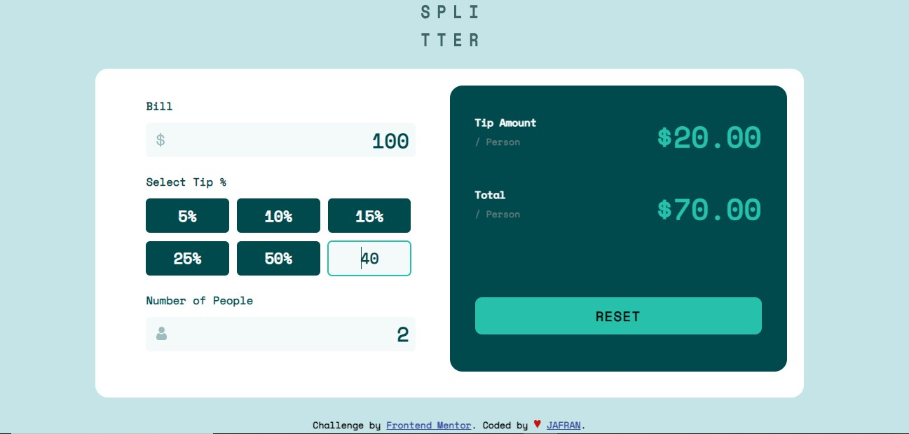

# Frontend Mentor - Tip calculator app solution

## Table of contents

  - [The challenge](#the-challenge)
  - [Screenshot](#screenshot)
  - [Links](#links)
  - [Built with](#built-with)
- [Author](#author)

### The challenge

Users should be able to:

- View the optimal layout for the app depending on their device's screen size
- See hover states for all interactive elements on the page
- Calculate the correct tip and total cost of the bill per person

### Workflow

To use the tip calculator, you will need to enter the bill amount, then the number of people then LASTLY the tip amount. For some reason that is the only way it will work. If you don't enter the information accordingly, NaN will be displayed as the tip calculation.

### Screenshot

1: Home Screen Screenshot

2: Screenshot While working 

3: Screenshot while an error occurr

### Links

- Solution URL: [Add solution URL here]([https://your-solution-url.com](https://github.com/JafranAhmad/tip-calculator-app-main))
- Live Site URL: [Add live site URL here]([https://your-live-site-url.com](https://jafranahmad.github.io/tip-calculator-app-main/))

### Built with

- Semantic HTML5 markup
- CSS custom properties
- Flexbox

- Mobile-first workflow
- For Responsiveness i used Media Queries
  instead of any library to show better 
  view on different Screen size

- Vanila JavaScript
- DOM (Document Object Model)

## Author

- Website - [Jafran](https://github.com/JafranAhmad)
- Frontend Mentor - [@JafranAhmad](https://www.frontendmentor.io/profile/JafranAhmad)
- Linkedin - [@jafran-ahmad](https://www.linkedin.com/in/jafran-ahmad/)

